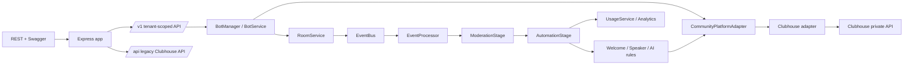

# Architecture

This document describes the implemented architecture of the AI Community Automation Platform (MVP).

## Overview

The project refactors the original Clubhouse bot into a **multi-tenant, multi-bot, multi-room AI community automation platform**. The original Clubhouse integration is preserved but isolated behind a platform adapter so that other platforms (Discord later) can be added without touching the core domain.

The core layering is:

```text
API (HTTP)
   │
   ▼
Bot Management (Bots / Rooms / Credentials / Tenants)
   │
   ▼
Event / Automation Engine (Moderation → Welcome / AI / Speaker)
   │
   ▼
Platform Adapter (Clubhouse)
   │
   ▼
Clubhouse private API
```



## Runtime model — exactly ONE live bot runtime

The MVP runs a **single process**: the API server (`src/server.ts`) owns the
only live BotManager runtime (bot room loops, automation, AI, usage). The
standalone worker entry (`src/worker.ts`) is **future infrastructure**
(Scheduler → Queue → Worker) and is deliberately not wired or deployed —
running it alongside the API would create a second live bot runtime.

## Key rules

- **Core domain** (`src/core/*`) depends only on the `CommunityPlatformAdapter` interface — never on a platform-specific API.
- **Platform-specific logic** lives in `src/platforms/clubhouse/*`.
- **Database access** sits behind repository interfaces; services depend on the interface, not Mongoose.
- **Controllers stay thin** — business logic lives in services/domain modules.
- **No process-global mutable state** — bots/rooms are addressed per-tenant and per-bot; the bot manager owns per-bot runtime maps (`botId`, `botId:roomId`).

## Source layout

```text
src/
├── api/                  # Modern /v1 API (routers, controllers, middleware, validation)
├── core/                 # Platform-agnostic domain
│   ├── ai/               #   AI provider, trigger/cooldown, agent bridge
│   ├── automation/       #   Rule engine, automation stage, rules (welcome/speaker/AI)
│   ├── bots/             #   Bot model, service, manager (runtime lifecycle)
│   ├── credentials/      #   Encrypted credentials
│   ├── events/           #   EventBus, EventProcessor, event types
│   ├── rooms/            #   Rooms, room members, room service (join/leave/sync)
│   ├── tenants/          #   Tenant + API-key auth
│   ├── usage/            #   Usage recording + analytics
│   ├── types.ts          #   Normalized Message/Room/User/Platform types
│   └── startup.ts        #   Wires the event pipeline at boot
├── infrastructure/
│   ├── deduplication/    #   Message deduplicator (Mongo + in-memory)
│   └── queue/            #   Job queue abstraction (in-memory for MVP)
├── platforms/
│   ├── adapter.ts        #   CommunityPlatformAdapter contract + factory registry
│   └── clubhouse/        #   Clubhouse adapter, private-API client, mappers
├── workers/              #   Background jobs (scheduler, handlers, worker)
├── models/               #   Mongoose models
├── routes/               #   Legacy /api routes
├── controllers/          #   Legacy /api controllers
└── services/             #   Legacy services (channel, chatbot, openai, club-api)
```

## Main processes

- **API server** (`src/server.ts` → `dist/server.js`) — the ONLY live process. Serves HTTP + Swagger, boots the BotManager runtime (`botManager.startAll()` exactly once), and runs the event pipeline (moderation → automation → usage) in-process.
- **Worker** (`src/worker.ts` → `dist/worker.js`) — FUTURE infrastructure. Not started in the MVP; must not boot live bots. Reserved for the Scheduler → Queue → Worker architecture.

## Event durability

The in-memory `EventBus` is backed by a **durable Mongo event store** (`src/core/events/event-store.ts`, `src/models/communityEvent.ts`). `RoomService.publish` persists the event **before** dispatching it to the bus, so a process crash cannot lose an accepted event. Each event has a **deterministic id** (derived from type + room + message/user id) so duplicates are processed exactly once.

The `EventProcessor` tracks each event through `pending → processing → processed/failed` and, on startup, **recovers** incomplete events left by a prior run. Failures are **bounded-retry** (max 3 attempts) before a terminal `failed` state. Processed events carry a TTL (30 days) for retention; pending/processing/failed events are never TTL-deleted so recovery always sees them. The store interface is queue-agnostic so a future Redis/Kafka-backed implementation can drop in without touching the processor.

## Runtime model diagram (detailed)

The diagram below shows how the single API process hosts per-bot runtimes while enforcing tenant boundaries. Note the per-bot `runtimes` map and per-room `botId:roomId` loops; credential decryption happens only inside `BotService.createAdapter` and the resulting adapter instance is owned by that bot's runtime.

```mermaid
flowchart TD
   subgraph API_Process[API process (single runtime)]
      direction TB
      Server[Express Server]
      Server --> BotManager[BotManager (runtimes map)]
      BotManager --> RuntimeA[Runtime: botA]
      BotManager --> RuntimeB[Runtime: botB]
      RuntimeA --> AdapterA[Adapter (decrypted cred for tenantA/botA)]
      RuntimeB --> AdapterB[Adapter (decrypted cred for tenantB/botB)]
      RuntimeA --> LoopA1[Loop botA:room1]
      RuntimeA --> LoopA2[Loop botA:room2]
      RuntimeB --> LoopB1[Loop botB:room3]
      LoopA1 -->|getMessages / ping| AdapterA
      LoopA2 -->|getMessages / ping| AdapterA
      LoopB1 -->|getMessages / ping| AdapterB
      Server --> EventStore[Durable Event Store (Mongo)]
      Server --> EventProcessor[EventProcessor]
      EventProcessor --> Automation[Automation Stage]
   end

   Client --> Server
   AdapterA --> ClubhouseAPI[Clubhouse private API]
   AdapterB --> ClubhouseAPI
```

Key takeaways:

- The API process boots exactly one `BotManager`. Each `Runtime` holds a single adapter instance created from a tenant-scoped, active credential; adapters are never shared across tenants or bots.
- Room sync loops and active-ping loops are scoped to `botId:roomId` and always call the adapter instance owned by that runtime.
- Events are persisted to the durable store before being published; the `EventProcessor` recovers on restart and replays pending/processing events for deterministic behavior.

## AI reliability

The OpenAI provider (`src/core/ai/openai.provider.ts`) enforces a **25s request timeout** and **bounded transient retry** (max 2 attempts with backoff). Transient failures (429, 5xx, network/timeout) are retried; permanent failures (4xx auth/request/policy) fail fast. AI failures never crash the room loop — a permanent failure or exhausted retries yield an empty (skipped) response, and errors are logged without leaking the API key or prompt.

## See also

- [`docs/api.md`](api.md) — the HTTP API surface.
- [`docs/bot-lifecycle.md`](bot-lifecycle.md) — bot runtime lifecycle.
- [`docs/automation.md`](automation.md) — the event/automation pipeline.
- [`docs/platforms.md`](platforms.md) — platform adapters.
- [`docs/security.md`](security.md) — tenant isolation, credentials, and auth.
