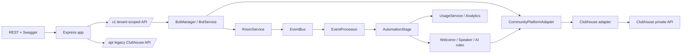

# Architecture

This document describes the implemented architecture of the AI Community Automation Platform (MVP).

## Overview

The project refactors the original Clubhouse bot into a **multi-tenant, multi-bot, multi-room AI community automation platform**. The original Clubhouse integration is preserved but isolated behind a platform adapter so that other platforms (Discord later) can be added without touching the core domain.

The core layering is:

```text
API (HTTP)
   │
   ▼
Bot Management (Bots / Rooms / Credentials / Tenants)
   │
   ▼
Event / Automation Engine (Welcome / AI / Speaker)
   │
   ▼
Platform Adapter (Clubhouse)
   │
   ▼
Clubhouse private API
```



## Key rules

- **Core domain** (`src/core/*`) depends only on the `CommunityPlatformAdapter` interface — never on a platform-specific API.
- **Platform-specific logic** lives in `src/platforms/clubhouse/*`.
- **Database access** sits behind repository interfaces; services depend on the interface, not Mongoose.
- **Controllers stay thin** — business logic lives in services/domain modules.
- **No process-global mutable state** — bots/rooms are addressed per-tenant and per-bot; the bot manager owns per-bot runtime maps (`botId`, `botId:roomId`).

## Source layout

```text
src/
├── api/                  # Modern /v1 API (routers, controllers, middleware, validation)
├── core/                 # Platform-agnostic domain
│   ├── ai/               #   AI provider, trigger/cooldown, agent bridge
│   ├── automation/       #   Rule engine, automation stage, rules (welcome/speaker/AI)
│   ├── bots/             #   Bot model, service, manager (runtime lifecycle)
│   ├── credentials/      #   Encrypted credentials
│   ├── events/           #   EventBus, EventProcessor, event types
│   ├── rooms/            #   Rooms, room members, room service (join/leave/sync)
│   ├── tenants/          #   Tenant + API-key auth
│   ├── usage/            #   Usage recording + analytics
│   ├── types.ts          #   Normalized Message/Room/User/Platform types
│   └── startup.ts        #   Wires the event pipeline at boot
├── infrastructure/
│   ├── deduplication/    #   Message deduplicator (Mongo + in-memory)
│   └── queue/            #   Job queue abstraction (in-memory for MVP)
├── platforms/
│   ├── adapter.ts        #   CommunityPlatformAdapter contract + factory registry
│   └── clubhouse/        #   Clubhouse adapter, private-API client, mappers
├── workers/              #   Background jobs (scheduler, handlers, worker)
├── models/               #   Mongoose models
├── routes/               #   Legacy /api routes
├── controllers/          #   Legacy /api controllers
└── services/             #   Legacy services (channel, chatbot, openai, club-api)
```

## Main processes

- **API server** (`src/server.ts` → `dist/server.js`) — HTTP + Swagger; also embeds the worker for the single-process MVP.
- **Worker** (`src/worker.ts` → `dist/worker.js`) — standalone background process for production (same core pipeline, no HTTP).

## See also

- [`docs/api.md`](api.md) — the HTTP API surface.
- [`docs/bot-lifecycle.md`](bot-lifecycle.md) — bot runtime lifecycle.
- [`docs/automation.md`](automation.md) — the event/automation pipeline.
- [`docs/platforms.md`](platforms.md) — platform adapters.
