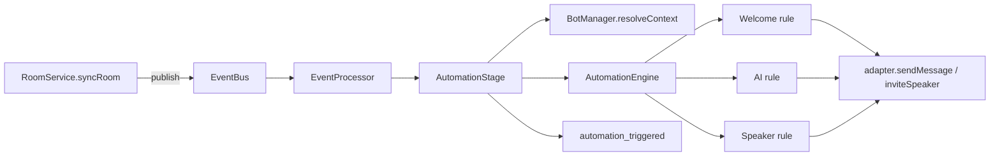

# Automation

The event/automation pipeline decides what the bot does when things happen in a room.

## Events

Normalized, platform-agnostic community events (`src/core/events/event.types.ts`), each scoped by `tenantId`, `botId`, and `roomId`:

```text
room.joined · room.left · room.ended · user.joined · user.left
message.created · speaker.requested · speaker.invited
```

`RoomService` publishes `room.joined`, `room.left`, `user.joined`, and `message.created` as it syncs rooms.

## Pipeline



- **EventBus** — typed publish/subscribe.
- **EventProcessor** — subscribes to the bus and runs registered stages sequentially for each event. A failing stage is logged but does not block later stages. A stage that returns `'block'` stops the pipeline for that event so later stages never see it.
- **ModerationStage** — runs first, before automation/AI. Gates `message.created` events (blocked users, blocked keywords, per bot+room+user rate limit) when the room's `moderationEnabled` is on; a blocked event is `'block'`ed and never reaches the rules or the usage stage.
- **AutomationStage** — handles `user.joined`, `message.created`, and `speaker.requested`. It resolves a rule context (bot + room + adapter) through `BotManager.resolveContext` — so the stage never decrypts credentials or touches platform internals — then evaluates the rules and records `automation_triggered` usage.
- **UsageStage** — turns platform-observed events into usage records (`room.joined`→`room_join`, `room.left`→`room_leave`, `message.created`→`message_received`, `speaker.invited`→`speaker_invite`). Runs last, so blocked events produce no usage.

## Example: end-to-end event flow (message → AI response)

This sequence shows a message arriving in a room and how it yields an AI response via the runtime-owned adapter. Tenant and bot ids are carried on every event so runtime actions never cross-tenant boundaries.

```mermaid
sequenceDiagram
    participant Adapter as Adapter (botA)
    participant Loop as Room Sync Loop (botA:room1)
    participant RoomSvc as RoomService
    participant Store as EventStore (Mongo)
    participant Bus as EventBus
    participant Proc as EventProcessor
    participant Auto as AutomationStage
    participant BotMgr as BotManager
    participant AI as AiService

    Loop->>Adapter: getMessages(externalRoomId)
    Adapter-->>Loop: [msg] (userId=u42, content="Hi botA")
    Loop->>RoomSvc: normalize message & persist
    RoomSvc->>Store: persist(event {tenantId:T1, botId:botA, roomId:room1, ...})
    RoomSvc->>Bus: publish(message.created)
    Bus->>Proc: event
    Proc->>Auto: deliver to AutomationStage
    Auto->>BotMgr: resolveContext(event.botId)
    BotMgr-->>Auto: RuleContext { bot, room, adapter, botUserId }
    Auto->>AI: AiService.decide & generateResponse(context, message)
    AI-->>Auto: { content: 'Hello!' }
    Auto->>Auto: template/format response
    Auto->>Auto: record automation_triggered
    Auto->>Adapter: sendMessage(externalRoomId, 'Hello!')
```

Example `RuleContext` API (what rules use):

```ts
interface RuleContext {
    botId: string
    tenantId: string
    roomId: string
    adapter: CommunityPlatformAdapter
    botUserId?: string
    sendMessage: (content: string) => Promise<void>
    inviteSpeaker: (userId: string) => Promise<void>
}
```

Notes:

- `BotManager.resolveContext` enforces that the runtime has a loaded adapter for `botId` and returns `null` otherwise — rules never decrypt credentials themselves.
- Because adapters are created from decrypted credentials inside `BotService.createAdapter`, the adapter instance is the only place plaintext tokens exist in memory; rules operate through the adapter API only.
- Automation rules must treat `botUserId` (the bot's external account id) specially to suppress the bot's own messages when filtering triggers.

## Rules

Rules are pure predicates plus a `run` that acts through a `RuleContext` (`sendMessage`, `inviteSpeaker`) bound to the bot's adapter.

| Rule | Matches | Behavior |
| --- | --- | --- |
| **Welcome** (`welcome.rule.ts`) | `user.joined` | Sends the bot's `welcomeMessage` template with `{username}` substituted (default: `Welcome {username}! 👋`). Honored only when the room's `welcomeEnabled` is on. |
| **Speaker request** (`speaker.rule.ts`) | `message.created` | If the room's `autoInviteEnabled` is on and the user is on the allow-list (`INVITE_ALLOW_LIST` or injected) and the message contains an invite keyword (`invite`, `stage`, `speaker`, `استیج`, …), invites the user to speak. In-session de-dupe prevents repeat invites. |
| **AI Q&A** (`ai.rule.ts`) | `message.created` | If the room's `aiEnabled` and the bot's `aiConfig.enabled` are on, asks the AI service whether to respond and sends the answer. See [`docs/ai.md`](ai.md). |

## Wiring

`src/core/startup.ts` (`configureEventPipeline`) registers the moderation, automation, and usage stages on the shared bus and starts the processor during server bootstrap.
